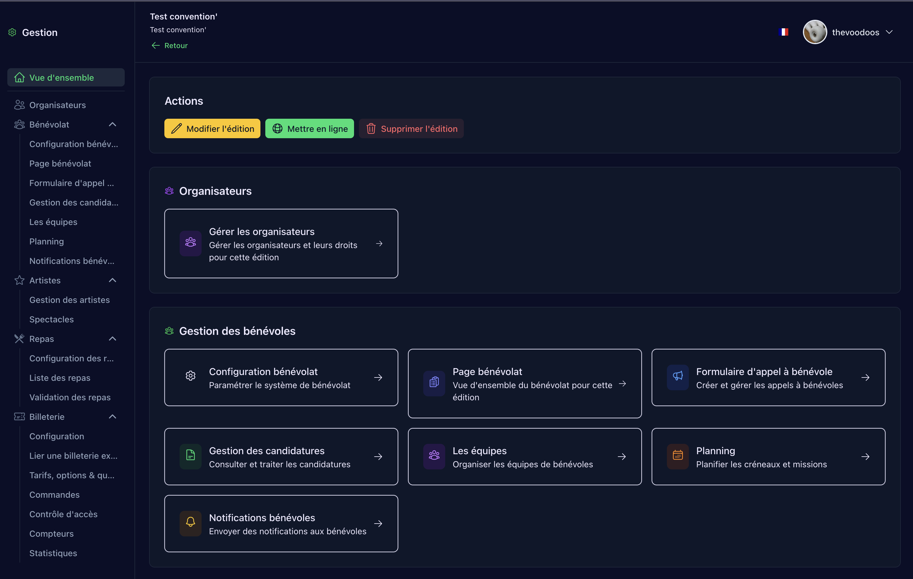
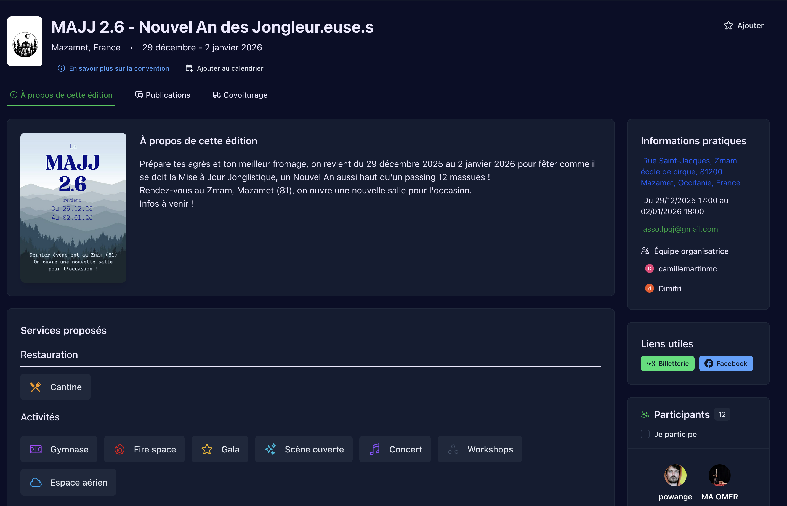
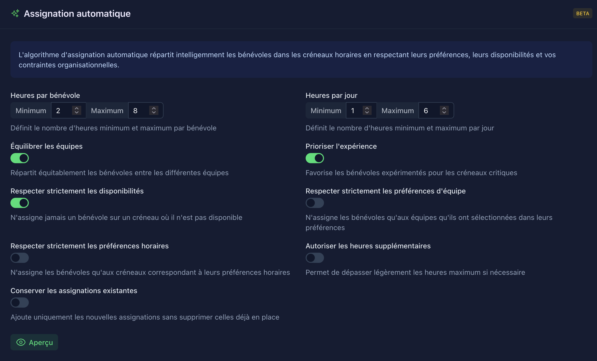
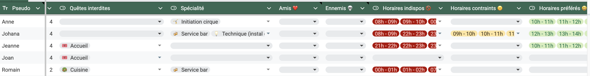
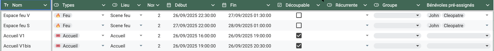
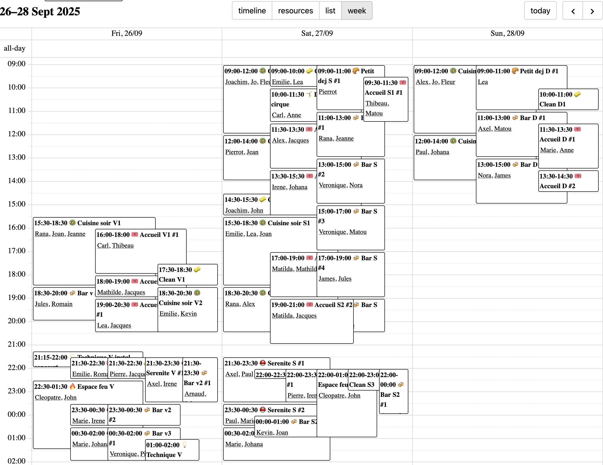

{#start }
# Planning bénévole: de nouveaux outils

{pause up="start"}

## Le planning c'est long et difficile

40 tâches pour deux bénévoles et 35 bénévoles = plus de $10^{29}$ combinaisons possibles

{pause}
- Beaucoup sont évidemment mauvaises:
  - Un bénévole ne peux pas faire deux tâches en même temps.
  - Tout le monde ne peut pas faire toutes les tâches.
  - Il faut préserver du temps pour les repas.
  - etc.
{pause}
- Et toutes les solutions correctes ne se valent pas:
  - Respect des préférences individuelles d'horaires et de types de tâches.
  - Équilibre des temps de travail.
  - Permettre à tout le monde d'assister à un maximum de spectacles.
  - etc.

{.block pause center}
Il est facile de trouver une solution... Mais très difficile de trouver la meilleure, tout du moins dans une temps raisonnable.

{pause}
 🐵 Les humains sont plutôt doués pour cette tâche, et l'intuition permet d'arriver à des solutions convenables. Mais c'est très chronophage et rarement optimal.

{pause}
🤖 Les problèmes de planning sont aussi très adaptés aux solutions automatiques: il est possible de les traduire en formules logiques pour lesquelles il existe de nombreux solveurs.

{pause up="~margin:40"}
## Deux outils en cours de développement par des membres de l'AFJ

- Un outil polyvalent de gestion des conventions: **Juggling Convention par Pierre**
- Un outil spécialisé dans la génération de planning: **Toubénev par Ulysse et Émile**

{pause slip up="~margin:40"}
---
### Juggling Convention [https://juggling-convention.com](https://juggling-convention.com){target=_blank}
Un site internet offrant une interface combinée pour gérer de nombreux aspect d'une convention, en amont et pendant l'évènement:

{width=100%}

{#this pause up="~margin:40"}
Et une chouette interface pour faire la promo et donner les infos:

{width=100%}

{#this pause up="~margin:40"}
Juggling Convention propose également un outil de génération automatique de planning:

{width=100%}

{pause} Un très bon moyen de faire un premier jet !

{pause center="mais"}
---

{#mais .block}
Mais l'algorithme "glouton"
utilisé ne permet pas d'atteindre une solution optimale.

{pause slip up="~margin:40"}
---
### Toubénev

- Un projet initié au sein des Bras Croisés pour Aurillac 2024: 90 bénévoles, 420 créneaux à remplir, de quoi donner la migraine 🤯

{pause}
- L'objectif: un outil capable de sortir un planning utilisable sans modifications ultèrieures.

{pause}
- La technique: traduire les contraintes sous forme de formules logiques et utiliser un solveur-optimiseur existant. Ces outils, tels que Z3 ou CP-Sat sont très performants pour trouver des solutions à des problèmes compliqués.

{pause center}
- Exemples de contraintes et préférences prises en charge:
  - Disponibilités des bénévoles
  - Préférences horaires des bénévoles
  - Quêtes préférées
  - Quêtes réservées
  - Bénévoles pré-assignés
  - Tâches obligatoires au moins une fois: le nettoyage par exemple
  - Quêtes suivies
  - Pas deux fois le même spectacle
  - Bénévoles amis / ennemis
  - Pause quotidienne d'une certaine durée
  - Maximisation de la diversité des tâches pour chaque bénévole
  - Minimisation des écarts de temps de travail quotidiens et sur la semaine
  - Minimisation de l'amplitude horaire quotidienne
  - Etc.

{pause center .block}
L'outil va proposer des solutions respectant toutes les contraintes jusqu'à en trouver une qui soit optimale, ou s'arrêter au bout d'un temps donné.

Pour un petit évènement, tel que Super Brassac, la convergence vers une solution optimale est quasiment instantanée.

{pause center}
L'entrée des données se fait actuellement via une [feuille](https://docs.google.com/spreadsheets/d/1VkJOyRG-ajtmhvy5klsw7VHxNVBuH415ORll_ytWlXw/edit?usp=sharing){target=_blank} Google Sheet (ou Notion)

{width=100%}
{width=100%}

{pause up="~margin:40"}
Et le planning est exporté dans différents formats (ical, csv) ainsi qu'un [petit site](https://team-afj.github.io/toubenev/#user=all){target=_blank} encore très expérimental&nbsp;:

{width=95%}

{pause center}
Au contraire de Juggling Convention, il n'y a pas encore d'interface utilisateur aboutie pour utiliser cet outil. Ulysse et Emile accompagnent les organisateurs qui souhaitent l'utiliser au cas par cas.

{pause .block}
N'hésitez pas à en faire la demande, l'outil est déjà apte à simplifier grandement l'établissement du planning, et c'est en l'utilisant que l'on pourra le bonifier !

{pause center="suite"}
---
{#suite .block}
Ainsi ces deux outils sont complémentaires: Juggling Convention
permet la gestion de la plupart des aspects d'une convention tandis que Toubénev
se spécialise dans la génération de planning optimaux prenant en compte de nombreuses contraintes.

{pause up="~margin:150"}
## Conclusion

- Au moins, 2025 aura été une bonne année pour les outils d'aide à l'organisation de conventions... 😅

{pause}
- N'hésitez pas à nous contacter pour toute questions sur ces outils, et à en tirer parti, c'est comme ça qu'ils s'amélioreront !

{pause}
- Idéalement, ces deux outils, aujourd'hui indépendants, pourront interopérer et se compléter dans le futur...

{pause}

🍌
